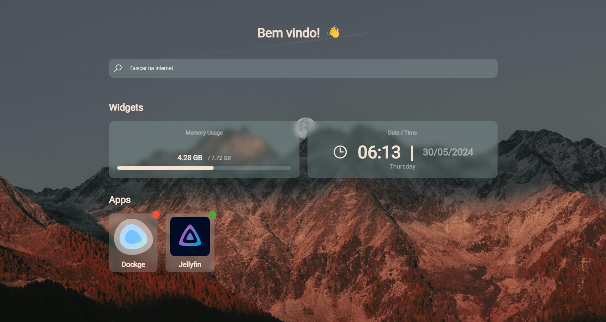

# Homainer

## Beautiful lightweight server dashboard for creating managing and monitoring docker containers through a web interface.



## Configuration

The application list is a simple JSON file that you can update, it is located at `/src/config/app-list.json`.

The data structure is very simple, we have three fields: `name`, `icon` and `url`.

example:
```json
[
    {
        "name": "Dockge",
        "icon": "https://dockge.kuma.pet/icon.svg",
        "url": "http://192.168.0.9:5001"
    }
]
```

Note: the frontend will periodically ping your service's url to check if it is still running and update the colored indicator at the top-right of your application icon

You will also find a `config.json` file in the same directory `/src/config/config.json` where you can customize the welcome message, the placeholder text for the search bar and the port in which the server runs.

The showToolbar feature is currently a WIP and shouldn't be enabled. 
```json
{
    "welcomeMessage": "Bem vindo!",
    "searchMessage": "Buscar na internet",
    "port": 7777,
    "showToolbar": false
}
```

## Installing / Running
Clone this repo and enter the directory with the commands:
```bash
git clone https://github.com/nicolasleao/homainer.git
```
```bash
cd homainer
```

This application comes with a `docker-compose.yml` file, so you can simply run:
```bash
docker compose build && docker compose up -d
```
to start it inside a minimal node container.

Alternatively you can run the node app manually with the commands
```bash
cd src/ && npm run start:prod
```

## Updating

You can always update directly through git by running
```bash
git fetch && git pull
```

Depending on your server configuration, you may need to run the following command to trust the repo
```bash
git config --global --add safe.directory /path/to/homainer
```
